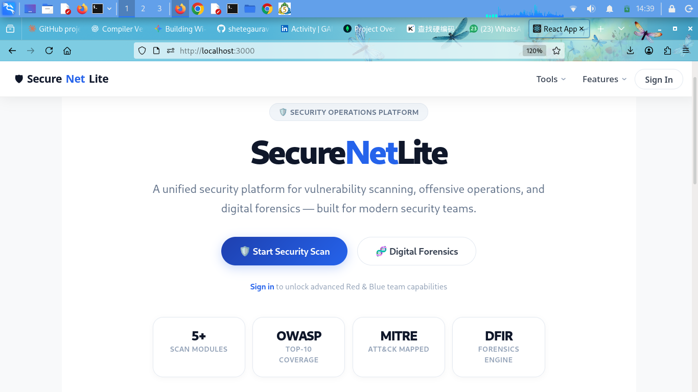
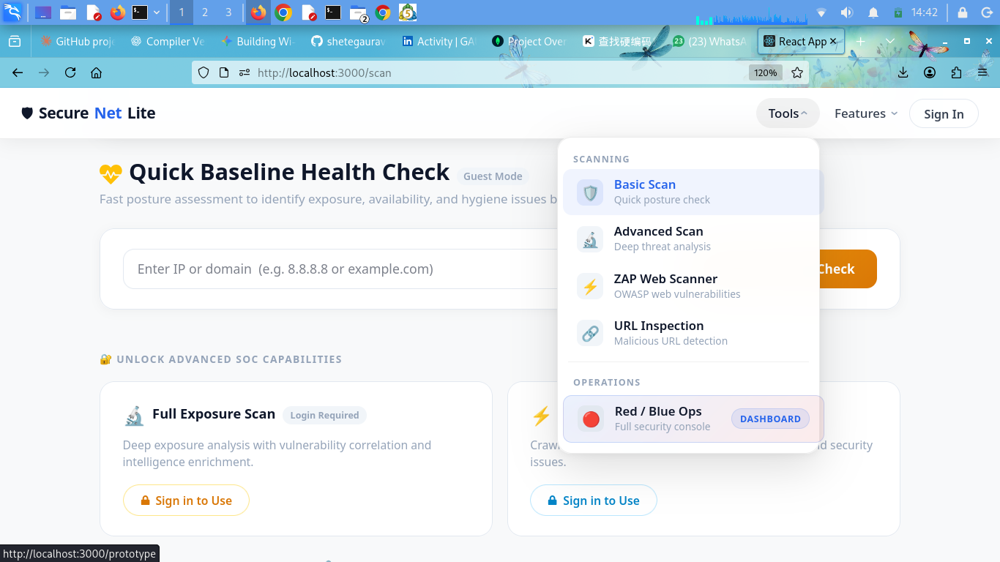
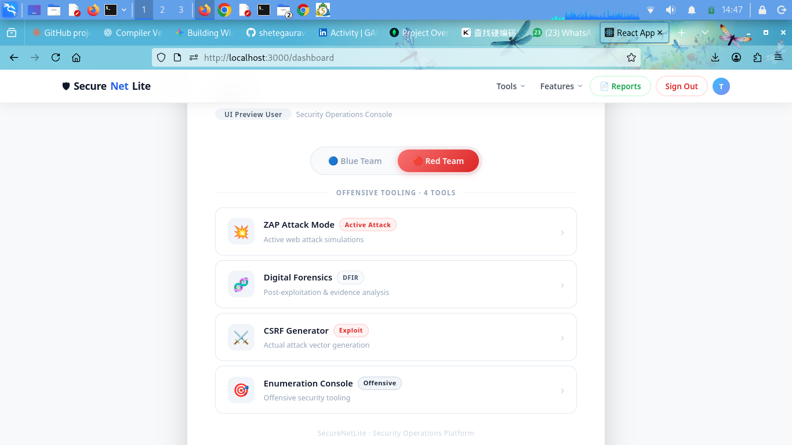
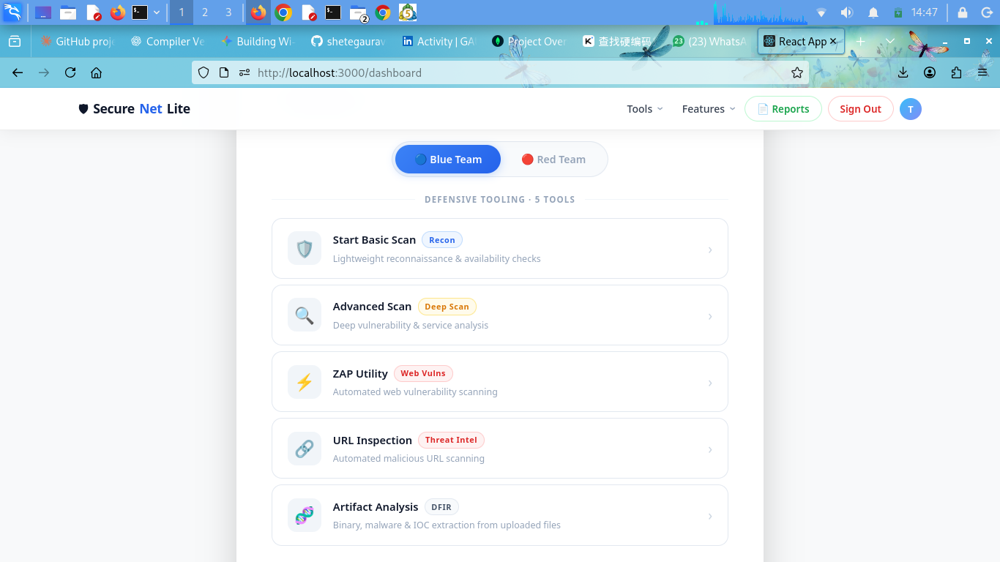
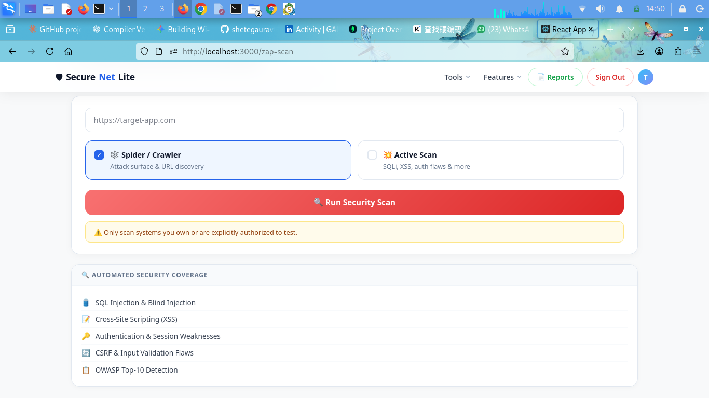
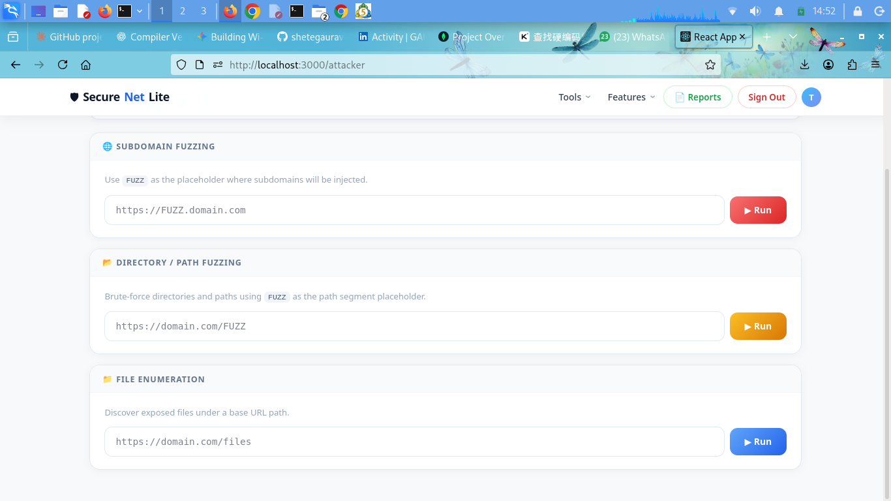
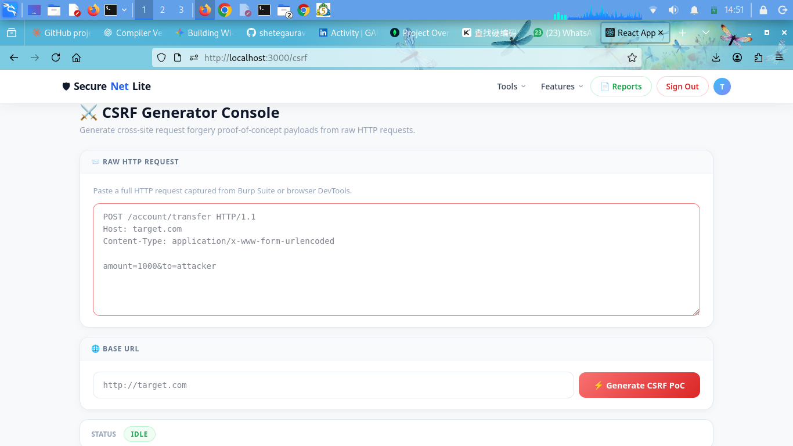
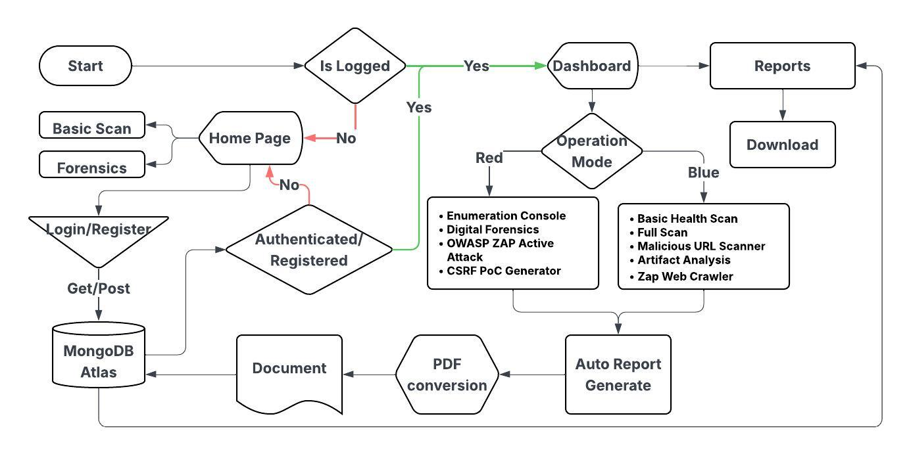

# 🔒 SecureNetLite - Security Scanning & Forensics Platform

A comprehensive web-based security scanning and digital forensics platform built with FastAPI and React.


Preview ink : https://secure-net-lite-red-blue-team-dashb.vercel.app/

---

## 📋 Table of Contents

- [Overview](#overview)
- [Features](#features)
- [Architecture](#architecture)
- [Installation](#installation)
- [Usage](#usage)
- [API Documentation](#api-documentation)
- [Project Structure](#project-structure)
- [Module Documentation](#module-documentation)
- [Frontend Pages](#frontend-pages)
- [Environment Variables](#environment-variables)
- [Contributing](#contributing)
- [License](#license)
- [Disclaimer](#disclaimer)

---

## 🎯 Overview

SecureNetLite is a full-stack security assessment tool that integrates multiple scanning engines and forensic analysis capabilities into a unified platform. It provides both offensive security testing tools and defensive forensics analysis.

### Core Capabilities

- **Network Scanning**: Nmap integration for port scanning and service detection
- **Web Vulnerability Scanning**: OWASP ZAP integration for crawling and active scanning
- **Directory Enumeration**: FFUF-powered fuzzing and directory brute-forcing
- **Threat Intelligence**: Shodan integration for external reconnaissance
- **Digital Forensics**: File artifact analysis with YARA, PE analysis, and entropy detection
- **Malicious URL Detection**: Heuristic-based URL threat analysis
- **CSRF PoC Generation**: Automated CSRF proof-of-concept generation
- **Report Generation**: Automated PDF report creation and management

---

## 📸 Screenshots

<table>
  <tr>
    <td width="50%">
      
      <p align="center"><sub><b>Home Page</b></sub></p>
    </td>
    <td width="50%">
      
      <p align="center"><sub><b>Home Page — Feature Overview</b></sub></p>
    </td>
  </tr>
  <tr>
    <td width="50%">
      
      <p align="center"><sub><b>Red Team — Attack Tools</b></sub></p>
    </td>
    <td width="50%">
      
      <p align="center"><sub><b>Blue Team — Digital Forensics</b></sub></p>
    </td>
  </tr>
  <tr>
    <td width="50%">
      
      <p align="center"><sub><b>OWASP ZAP Web Scan</b></sub></p>
    </td>
    <td width="50%">
      
      <p align="center"><sub><b>FFUF Fuzzing / Enumeration</b></sub></p>
    </td>
  </tr>
  <tr>
    <td width="50%">
      
      <p align="center"><sub><b>CSRF PoC Generator</b></sub></p>
    </td>
    <td width="50%"></td>
  </tr>
</table>


## ✨ Features

### Backend Capabilities

| Module | Function | Description |
|--------|----------|-------------|
| `nmap_scan.py` | `run_nmap()` | Network port scanning and service detection |
| `basic_scan.py` | `run_basic_scan()` | Health check with port classification |
| `shodan_scan.py` | `run_shodan()` | Shodan API integration for host intelligence |
| `whois_scan.py` | `run_whois()` | WHOIS lookup for domain information |
| `zap_crawler.py` | `zap_spider_scan()`, `zap_active_scan()` | OWASP ZAP web crawling and active scanning |
| `ffuf_engine.py` | `run_ffuf()` | High-speed directory and file fuzzing |
| `dir_enum_engine.py` | `run_dir_enum()` | Directory enumeration |
| `nuclei.py` | `run_nuclei()` | Nuclei vulnerability scanning |
| `interactsh.py` | `run_interactsh()` | OOB interaction testing |
| `artifact_scanner.py` | `run_forensic_scan()` | Digital forensics analysis |
| `maliciousURL.py` | `MaliciousURLScanner()` | Heuristic URL threat detection |
| `CSRFgen.py` | `CSRFGenerator()` | CSRF PoC generation |
| `fullscan.py` | `perform_full_scan()` | Comprehensive multi-tool scanning |
| `ping_scan.py` | `ping_host()` | ICMP ping utility |

### Frontend Pages

| Page | Route | Features |
|------|-------|----------|
| HomePage | `/` | Landing page with feature overview |
| LoginPage | `/login` | User authentication |
| RegisterPage | `/register` | User registration |
| DashboardPage | `/dashboard` | Central navigation hub |
| ScanPage | `/scan` | Basic network scanning |
| FullScanPage | `/fullscan` | Comprehensive scanning |
| ZAPScanPage | `/zap-scan` | Web vulnerability scanning |
| AttackTool | `/attack-tool` | Offensive security tools |
| CSRFpage | `/csrf` | CSRF PoC generator |
| MaliciousURL | `/malicious-url` | URL threat analysis |
| DigitalForensicsPage | `/forensics` | File artifact analysis |
| ReportPage | `/reports` | PDF report management |
| Prototype | `/prototype` | Demo/prototype interface |

---

## 🏗️ Architecture


<p align="center">
  
</p>

```
┌─────────────────────────────────────────────────────────────┐
│                        FRONTEND (React)                      │
│  ┌──────────┐ ┌──────────┐ ┌──────────┐ ┌──────────┐        │
│  │HomePage  │ │ScanPage  │ │ZAPScan   │ │Forensics │        │
│  └──────────┘ └──────────┘ └──────────┘ └──────────┘        │
│  ┌──────────┐ ┌──────────┐ ┌──────────┐ ┌──────────┐        │
│  │LoginPage │ │Dashboard │ │AttackTool│ │ReportPage│        │
│  └──────────┘ └──────────┘ └──────────┘ └──────────┘        │
│                                                               │
│  AuthContext (JWT Token Management)                          │
│  API Utils (Axios Instance with Interceptors)                │
└──────────────────────────┬────────────────────────────────────┘
                            │ HTTP/REST API
                            ▼
┌─────────────────────────────────────────────────────────────┐
│                      BACKEND (FastAPI)                       │
│                                                               │
│  ┌────────────────────────────────────────────────────┐     │
│  │              Middleware (JWT Auth)                  │     │
│  └────────────────────────────────────────────────────┘     │
│                                                               │
│  ┌──────────────┐  ┌──────────────┐  ┌──────────────┐       │
│  │  Auth Router │  │  Scan APIs   │  │ Report APIs  │       │
│  └──────────────┘  └──────────────┘  └──────────────┘       │
│                                                               │
│  ┌────────────────────────────────────────────────────┐     │
│  │              Scan Modules                           │     │
│  │  ┌──────┐ ┌──────┐ ┌──────┐ ┌──────┐ ┌──────────┐  │     │
│  │  │ Nmap │ │ ZAP  │ │ FFUF │ │Shodan│ │ Forensics│  │     │
│  │  └──────┘ └──────┘ └──────┘ └──────┘ └──────────┘  │     │
│  │  ┌──────┐ ┌──────┐ ┌──────┐ ┌──────┐ ┌──────────┐  │     │
│  │  │Nuclei│ │WHOIS │ │ CSRF │ │ URL  │ │ FullScan │  │     │
│  │  └──────┘ └──────┘ └──────┘ └──────┘ └──────────┘  │     │
│  └────────────────────────────────────────────────────┘     │
│                                                               │
│  ┌──────────────┐  ┌──────────────┐  ┌──────────────┐       │
│  │  PDF Utils   │  │  MongoDB     │  │  File Upload │       │
│  └──────────────┘  └──────────────┘  └──────────────┘       │
└─────────────────────────────────────────────────────────────┘
```

---

## 🚀 Installation

### Prerequisites

- Python 3.8+
- Node.js 14+
- MongoDB
- Nmap
- Docker (for ZAP)
- FFUF
- Nuclei (optional)

### Backend Setup

```bash
# Navigate to backend directory
cd backend

# Create virtual environment
python -m venv venv
source venv/bin/activate  # On Windows: venv\Scripts\activate

# Install dependencies
pip install -r requirements.txt

# Configure environment variables
cp .env.example .env
# Edit .env with your actual credentials

# Start the server
python -m uvicorn main:app --host 0.0.0.0 --port 8000 --reload
```

### Frontend Setup

```bash
# Navigate to frontend directory
cd fron

# Install dependencies
npm install

# Configure environment variables
cp .env.example .env

# Start development server
npm start
```

### External Tools Setup

```bash
# Install Nmap
sudo apt install nmap

# Install FFUF
go install github.com/ffuf/ffuf@latest

# Install Nuclei
go install -v github.com/projectdiscovery/nuclei/v2/cmd/nuclei@latest

# Pull ZAP Docker image
docker pull ghcr.io/zaproxy/zaproxy:stable
```

---

## 💻 Usage

### Starting the Application

**Terminal 1 - Backend:**
```bash
cd backend
source venv/bin/activate
python -m uvicorn main:app --host 0.0.0.0 --port 8000 --reload
```

**Terminal 2 - Frontend:**
```bash
cd fron
npm start
```

**Access the application:**
- Frontend: http://localhost:3000
- Backend API: http://localhost:8000
- API Docs: http://localhost:8000/docs

### Quick Start Guide

1. **Register/Login**: Create an account or login with existing credentials
2. **Dashboard**: Access all tools from the central dashboard
3. **Basic Scan**: Enter an IP or domain for a quick health check
4. **Full Scan**: Run a comprehensive multi-tool assessment
5. **Web Scanning**: Use ZAP for web vulnerability detection
6. **Forensics**: Upload files for artifact analysis
7. **Reports**: View and download generated PDF reports

---

## 📡 API Documentation

### Authentication Endpoints

| Method | Endpoint | Description |
|--------|----------|-------------|
| POST | `/auth/register` | Register new user |
| POST | `/auth/login` | Login and get JWT token |
| GET | `/auth/me` | Get current user info |

### Scanning Endpoints

| Method | Endpoint | Description |
|--------|----------|-------------|
| GET | `/basic-scan?target=<ip>` | Run basic health check |
| GET | `/fullscan?target=<ip>` | Run comprehensive scan |
| POST | `/crawl?target=<url>` | ZAP spider crawl |
| POST | `/attack?target=<url>` | ZAP active scan |
| POST | `/enum/ffuf` | FFUF directory fuzzing |
| POST | `/enum/dirs` | Directory enumeration |
| POST | `/enum/csrf` | Generate CSRF PoC |
| POST | `/scan/malicious-url` | Check URL for threats |
| POST | `/forensics/scan` | Upload file for analysis |

### Report Endpoints

| Method | Endpoint | Description |
|--------|----------|-------------|
| GET | `/report/download?file=<name>` | Download report |
| GET | `/reports/pdfs` | List user PDF reports |
| GET | `/report/download/{pdf_id}` | Download PDF by ID |

> Full interactive API documentation (Swagger UI) is available at `/docs` once the backend is running.

---

## 📁 Project Structure

```
Project-2025/
│
├── backend/
│   ├── auth/
│   │   ├── routes.py            # Authentication endpoints
│   │   └── utils.py             # Password hashing, JWT creation
│   │
│   ├── db/
│   │   └── mongo.py             # MongoDB connection & collections
│   │
│   ├── middleware/
│   │   └── jwt_user.py          # JWT authentication middleware
│   │
│   ├── reports/                 # Generated scan reports (auto-generated)
│   │   └── .gitkeep
│   │
│   ├── scan_modules/
│   │   ├── __init__.py
│   │   ├── basic_scan.py        # Health check scanning
│   │   ├── nmap_scan.py         # Nmap port scanning
│   │   ├── shodan_scan.py       # Shodan intelligence
│   │   ├── whois_scan.py        # WHOIS lookup
│   │   ├── zap_crawler.py       # ZAP spider & active scan
│   │   ├── ffuf_engine.py       # FFUF fuzzing engine
│   │   ├── dir_enum_engine.py   # Directory enumeration
│   │   ├── nuclei.py            # Nuclei vulnerability scan
│   │   ├── interactsh.py        # OOB interaction testing
│   │   ├── artifact_scanner.py  # Digital forensics analysis
│   │   ├── maliciousURL.py      # Malicious URL detection
│   │   ├── CSRFgen.py           # CSRF PoC generator
│   │   ├── fullscan.py          # Comprehensive scanning
│   │   └── ping_scan.py         # ICMP ping utility
│   │
│   ├── uploads/                 # File upload directory
│   │   └── .gitkeep
│   │
│   ├── utils/
│   │   ├── pdf_lib.py           # PDF generation library
│   │   ├── pdf_uploader.py      # PDF upload to MongoDB
│   │   └── report_generator.py  # Report generation
│   │
│   ├── main.py                  # FastAPI application entry point
│   ├── requirements.txt         # Python dependencies
│   └── .env.example             # Environment variables template
│
├── fron/
│   ├── public/
│   │   └── index.html
│   │
│   ├── src/
│   │   ├── components/
│   │   │   ├── Navbar.js        # Navigation component
│   │   │   ├── Navbar.css
│   │   │   └── ProtectedRoute.js# Route protection
│   │   │
│   │   ├── context/
│   │   │   └── AuthContext.js   # Authentication context
│   │   │
│   │   ├── pages/
│   │   │   ├── HomePage.js      # Landing page
│   │   │   ├── LoginPage.js     # User login
│   │   │   ├── RegisterPage.js  # User registration
│   │   │   ├── DashboardPage.js # Central dashboard
│   │   │   ├── ScanPage.js      # Basic scanning
│   │   │   ├── FullScanPage.js  # Full scanning
│   │   │   ├── ZAPScanPage.js   # ZAP web scanning
│   │   │   ├── AttackTool.js    # Offensive tools
│   │   │   ├── CSRFpage.js      # CSRF generator
│   │   │   ├── MaliciousURL.js  # URL threat check
│   │   │   ├── DigitalForensicsPage.js # Forensics
│   │   │   ├── ReportPage.js    # Report management
│   │   │   └── Prototype.js     # Demo interface
│   │   │
│   │   ├── utils/
│   │   │   ├── api.js           # Axios instance
│   │   │   └── importAllImages.js
│   │   │
│   │   ├── assets/
│   │   │   └── security/        # Security-related images
│   │   │
│   │   ├── App.js               # Main App component
│   │   ├── App.css
│   │   ├── index.js             # React entry point
│   │   └── index.css
│   │
│   ├── package.json
│   └── .env.example              # Environment variables template
│
├── .gitignore
├── LICENSE
├── CONTRIBUTING.md
└── README.md
```

---

## 🔧 Module Documentation

### Scan Modules

#### 1. Basic Scan (`basic_scan.py`)
Performs a health check on the target with port classification.

**Functions:**
- `normalize_ports()` — Standardize port data
- `classify_ports()` — Categorize open ports by service type
- `ping_host()` — Check host availability
- `resolve_dns()` — Resolve hostname to IP
- `nmap_scan()` — Execute Nmap scan
- `calculate_health_score()` — Compute security score
- `run_basic_scan()` — Main entry point

#### 2. Nmap Scan (`nmap_scan.py`)
Network port scanning and service detection.

**Functions:**
- `run_nmap()` — Execute Nmap with specified options
- `parse_nmap_output()` — Parse and structure results

#### 3. Shodan Scan (`shodan_scan.py`)
External threat intelligence via Shodan API.

**Functions:**
- `run_shodan()` — Query Shodan for host information

#### 4. ZAP Crawler (`zap_crawler.py`)
OWASP ZAP integration for web scanning.

**Functions:**
- `zap_spider_scan()` — Passive crawling
- `zap_active_scan()` — Active vulnerability scanning

#### 5. FFUF Engine (`ffuf_engine.py`)
High-speed web fuzzing.

**Functions:**
- `run_ffuf()` — Execute FFUF with custom wordlists

#### 6. Artifact Scanner (`artifact_scanner.py`)
Digital forensics analysis.

**Functions:**
- `sha256_hash()`, `md5_hash()` — File hashing
- `file_entropy()` — Calculate entropy for packed/encrypted detection
- `extract_strings()` — Extract ASCII/Unicode strings
- `detect_credentials()` — Find hardcoded credentials
- `extract_archive()` — Analyze archive contents
- `pe_analysis()` — Windows PE file analysis
- `lief_analysis()` — Binary analysis with LIEF
- `yara_scan()` — YARA rule matching
- `analyze_file()` — Comprehensive file analysis
- `run_forensic_scan()` — Main entry point

#### 7. Malicious URL Scanner (`maliciousURL.py`)
Heuristic-based URL threat detection.

**Functions:**
- `domain_entropy()` — Calculate domain randomness
- `check_domain_age()` — Verify domain registration age
- `dns_resolves()` — Check DNS resolution
- `check_http_status()` — Verify HTTP response
- `scan()` — Comprehensive URL analysis

#### 8. CSRF Generator (`CSRFgen.py`)
Automated CSRF proof-of-concept generation.

**Functions:**
- `generate()` — Generate CSRF PoC from raw request
- `_parse_request()` — Parse HTTP request
- `_build_poc()` — Build HTML PoC
- `_get_poc()`, `_form_poc()`, `_json_poc()` — Different PoC types

#### 9. Full Scan (`fullscan.py`)
Comprehensive multi-tool scanning.

**Functions:**
- `perform_full_scan()` — Orchestrate all scanning modules

---

## 🎨 Frontend Pages

### Authentication Pages

**LoginPage (`/login`)**
- User authentication with JWT
- Dynamic API base URL detection
- Error handling and validation

**RegisterPage (`/register`)**
- New user registration
- Password strength indicator
- Form validation

### Dashboard & Navigation

**DashboardPage (`/dashboard`)**
- Central hub for all tools
- Quick access cards
- User info display

### Scanning Pages

**ScanPage (`/scan`)**
- Basic network scanning
- Target input (IP/domain)
- Real-time results display

**FullScanPage (`/fullscan`)**
- Comprehensive scanning
- Multiple tool integration
- Detailed reporting

**ZAPScanPage (`/zap-scan`)**
- Web vulnerability scanning
- Spider and active scan options
- PDF report download

### Tool Pages

**AttackTool (`/attack-tool`)**
- Offensive security tools
- CSRF and enumeration

**CSRFpage (`/csrf`)**
- CSRF PoC generator
- Raw request input
- HTML PoC output

**MaliciousURL (`/malicious-url`)**
- URL threat analysis
- Heuristic detection
- Risk scoring

### Analysis Pages

**DigitalForensicsPage (`/forensics`)**
- File upload for analysis
- Artifact scanning
- Detailed results display

**ReportPage (`/reports`)**
- PDF report listing
- Download functionality
- Scan history

---

## 🔐 Environment Variables

> ⚠️ Never commit real `.env` files or API keys to the repository. Only `.env.example` files with placeholder values should be tracked in Git.

### Backend (`.env`)

```env
# Database
MONGO_URI=mongodb://localhost:27017/

# JWT Secrets (generate strong random keys — do NOT reuse these placeholders)
JWT_SECRET_KEY=replace-with-a-generated-secret
SECRET_KEY=replace-with-a-generated-secret

# External APIs
SHODAN_API_KEY=your-shodan-api-key

# Server Config
HOST=0.0.0.0
PORT=8000
DEBUG=False
```

### Frontend (`.env`)

```env
# API Configuration
REACT_APP_API_URL=http://localhost:8000
REACT_APP_BACKEND_URL=http://localhost:8000
```

### Generating Secure Keys

```bash
# Generate JWT secret
python -c "import secrets; print(secrets.token_urlsafe(32))"

# Generate secret key
openssl rand -hex 32
```

---

## 🤝 Contributing

Contributions are welcome! Please follow these steps:

1. Fork the repository
2. Create a feature branch (`git checkout -b feature/AmazingFeature`)
3. Commit your changes (`git commit -m 'Add some AmazingFeature'`)
4. Push to the branch (`git push origin feature/AmazingFeature`)
5. Open a Pull Request

See [CONTRIBUTING.md](CONTRIBUTING.md) for full guidelines.

### Code Style

- Follow PEP 8 for Python code
- Use ESLint for JavaScript/React
- Write meaningful commit messages
- Add comments for complex logic

---

## 📄 License

This project is licensed under the MIT License — see the [LICENSE](LICENSE) file for details.

---

## ⚠️ Disclaimer

**IMPORTANT**: This tool is designed for educational purposes and authorized security testing only.

- Only scan systems you own or have explicit written permission to test
- Unauthorized scanning may be illegal in your jurisdiction
- The authors are not responsible for misuse of this tool
- Always follow responsible disclosure practices

---

## 🙏 Acknowledgments

- [OWASP ZAP](https://www.zaproxy.org/) — Web vulnerability scanner
- [Nmap](https://nmap.org/) — Network scanner
- [FFUF](https://github.com/ffuf/ffuf) — Fast web fuzzer
- [Nuclei](https://github.com/projectdiscovery/nuclei) — Vulnerability scanner
- [Shodan](https://www.shodan.io/) — Internet search engine
- [FastAPI](https://fastapi.tiangolo.com/) — Modern Python web framework
- [React](https://reactjs.org/) — JavaScript library for UI

---

## 📧 Contact

For questions or support, please open an issue on GitHub.

---

**Built for the security community**
